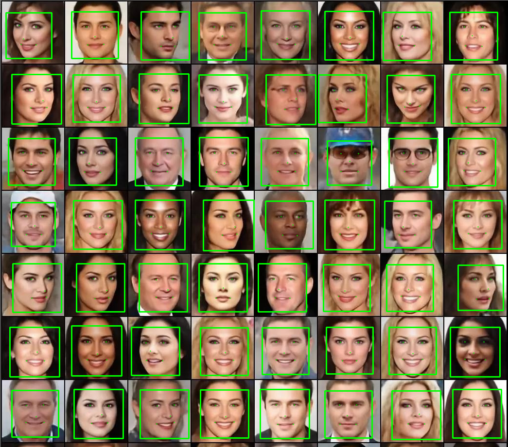
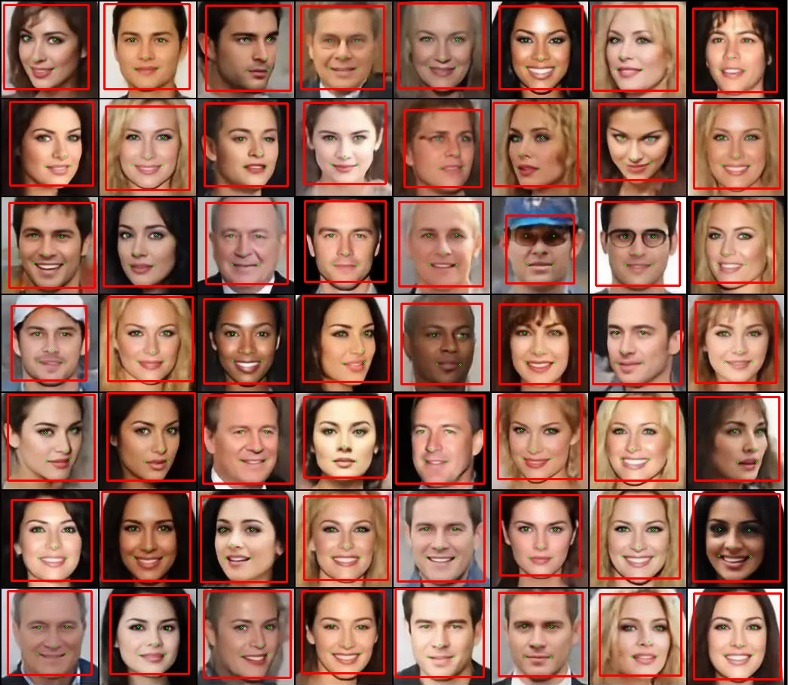

整合libfacedetection和mtcnn-light的人脸检测库，仅依赖于opencv

## 接口
### FaceDetection::Init(int mode, bool useGPU, int devId);
* mode:0使用libfacedetection；1使用mtcnn-ligth
* useGPU:是否使用GPU，0：不使用；1：使用
* int devId：选择GPU

### FaceDetection::face_detection_showImage(const cv::Mat& image)
输入图片进行检测

## 使用
使用libfacedetection测试

使用mtcnn-light测试

## 参考
* https://github.com/ShiqiYu/libfacedetection
* https://github.com/AlphaQi/MTCNN-light